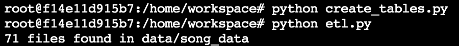
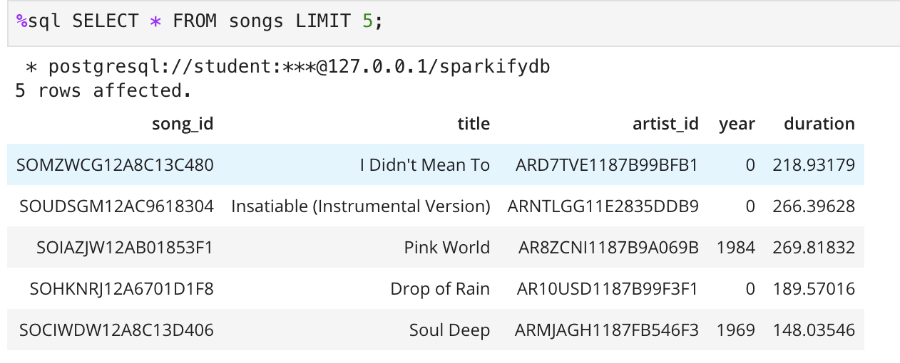
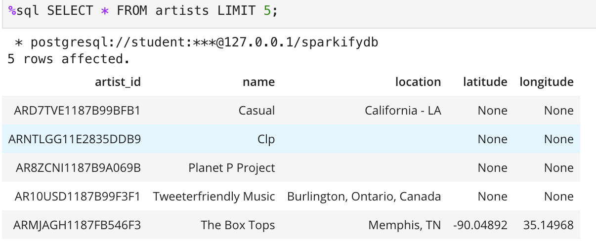
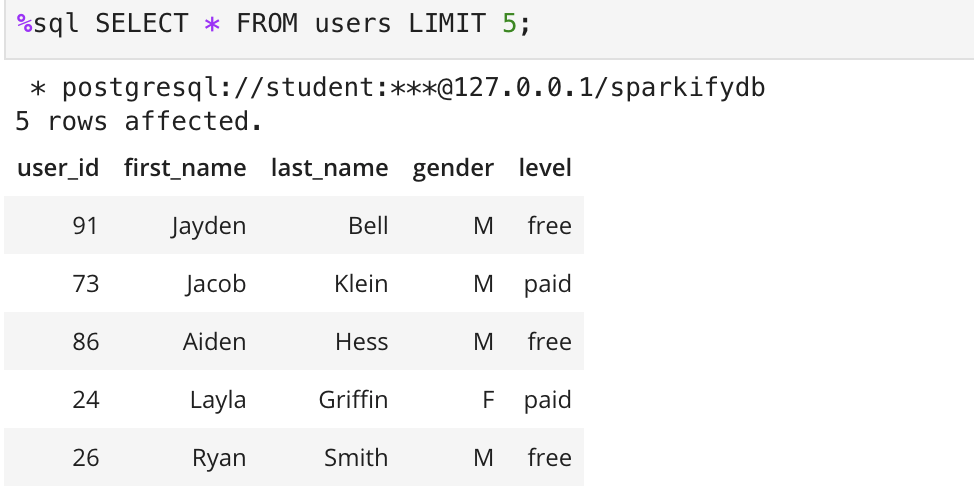
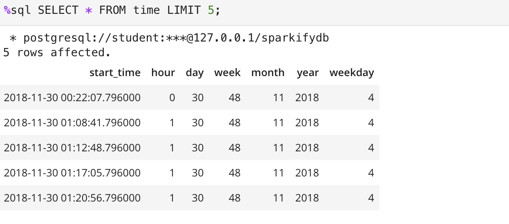
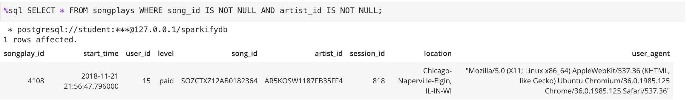

# Data Modeling With Postgres

# Introduction
A startup called Sparkify wants to analyze the data they've been collecting on songs and user activity on their new music streaming app. The analytics team is particularly interested in understanding what songs users are listening to. Currently, they don't have an easy way to query their data, which resides in a directory of JSON logs on user activity on the app, as well as a directory with JSON metadata on the songs in their app

## Project Description
To create an ETL pipeline using datamodeling principles with Postgres SQL and Python. The postgres tables are designed to analyse song play analysis.
A star schema with fact and dimensional tables will be designed for a particular analytical focus. 

## Project Datasets
Song Dataset and Log Datasets are available in data/song_data and data/log_data
Both these datasets are in the jSON format.

Song Dataset - Is a subset of real data from the Million Song Dataset. Each file contains metadata about song and the artist for that song. 

Sample data from the song dataset

```
{"num_songs": 1, "artist_id": "ARJIE2Y1187B994AB7", "artist_latitude": null, "artist_longitude": null, "artist_location": "", "artist_name": "Line Renaud", "song_id": "SOUPIRU12A6D4FA1E1", "title": "Der Kleine Dompfaff", "duration": 152.92036, "year": 0}
```

Log Dataset - These are log files in JSON format generated by an event simulator based on the songs in the song dataset. 


## Database design

### Dimension Tables
1. users - users in the app
    - user_id, first_name, last_name, gender, level
2. songs - songs in the music database
    - song_id, title, artist_id, year, duration
3. artists - artists in the music database
    - artist_id, name, location, latitude, longitude
4. time - timestamps of records in fact table broken down into specific units
    - start_time, hour, day, week, month, year, weekday
    
### Fact table
1. songplays - records in the log data associated with song plays. i.e records with page `NextSong`
    - songplay_id, start_time, user_id, level, song_id, artist_id, session_id, location, user_agent
    
### SQL 
```

# CREATE TABLES

songplay_table_create = ("""CREATE TABLE IF NOT EXISTS songplays(
                                                                    songplay_id serial PRIMARY KEY , 
                                                                    start_time timestamp NOT NULL, 
                                                                    user_id int NOT NULL, 
                                                                    level varchar, 
                                                                    song_id varchar, 
                                                                    artist_id varchar , 
                                                                    session_id int, 
                                                                    location varchar, 
                                                                    user_agent varchar
                                                                 )
""")

user_table_create = ("""CREATE TABLE IF NOT  EXISTS users(
                                                            user_id int PRIMARY KEY,
                                                            first_name varchar NOT NULL, 
                                                            last_name varchar, 
                                                            gender varchar, 
                                                            level varchar NOT NULL
                                                         )
""")

song_table_create = ("""CREATE TABLE IF NOT EXISTS songs (
                                                            song_id varchar PRIMARY KEY, 
                                                            title varchar NOT NULL , 
                                                            artist_id varchar NOT NULL, 
                                                            year int, 
                                                            duration numeric 
                                                         )
""")

artist_table_create = ("""CREATE tABLE IF NOT EXISTS artists (
                                                                artist_id varchar PRIMARY KEY, 
                                                                name varchar NOT NULL, 
                                                                location varchar, 
                                                                latitude numeric, 
                                                                longitude numeric
                                                              )
""")

time_table_create = ("""CREATE TABLE IF NOT EXISTS time (
                                                            start_time timestamp PRIMARY KEY NOT NULL,
                                                            hour int NOT NULL, 
                                                            day int NOT NULL, 
                                                            week int NOT NULL, 
                                                            month int NOT NULL, 
                                                            year int NOT NULL, 
                                                            weekday int NOT NULL
                                                        )
""")

# INSERT RECORDS

songplay_table_insert = ("""INSERT INTO songplays(start_time,user_id,level,song_id,artist_id,session_id,location,user_agent) 
                            VALUES(%s,%s,%s,%s,%s,%s,%s,%s)
""")

user_table_insert = ("""INSERT INTO users(user_id,first_name,last_name,gender,level) 
                        VALUES(%s,%s,%s,%s,%s) 
                        ON CONFLICT (user_id) 
                        DO 
                            UPDATE SET level = EXCLUDED.level
""")

song_table_insert = ("""INSERT INTO songs(song_id, title, artist_id, year, duration) 
                        VALUES(%s,%s,%s,%s,%s) ON CONFLICT DO NOTHING
""")

artist_table_insert = ("""INSERT INTO artists(artist_id,name,location,latitude,longitude) 
                          VALUES(%s,%s,%s,%s,%s) ON CONFLICT DO NOTHING
""")


time_table_insert = ("""INSERT INTO time(start_time,hour,day,week,month,year,weekday) 
                        VALUES(%s,%s,%s,%s,%s,%s,%s)
""")

# FIND SONGS

song_select = ("""SELECT songs.song_id, songs.artist_id 
                  FROM songs JOIN artists ON songs.artist_id = artists.artist_id 
                  WHERE songs.title = %s AND artists.name = %s AND songs.duration = %s
""")


```

### ETL Process
The code will read all the files in the data/song_data folder and loads the dimension tables songs and artists.
The code will read all the files in the data/log_data folder and loads the dimension tables time and users and also populates the fact table songplays

### How to run the python code
1. Open the launcher and type python create_tables.py
    This will create the 'sparkify' database and all the tables above
2. Next type python etl.py. This will then read the song and log files and load the above tables.    
    
    


### Sample Queries to check successful ETL run
```
SELECT * from songs LIMIT 5;
```


```
SELECT * FROM artists LIMIT 5;
```


```
SELECT * FROM users LIMIT 5;
```


```
SELECT * FROM time LIMIT 5;
```


```
SELECT * FROM songplays WHERE song_id IS NOT NULL AND artist_id IS NOT NULL;
```



